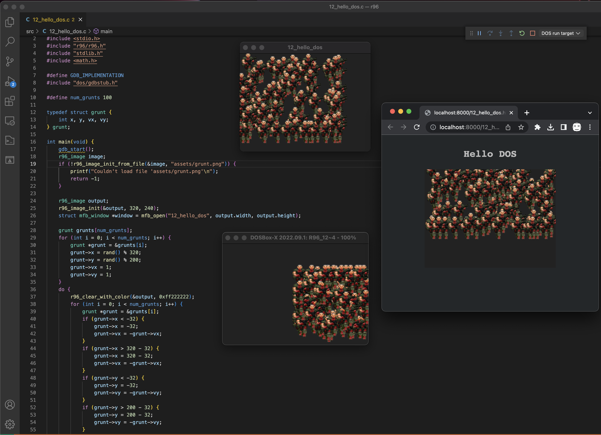
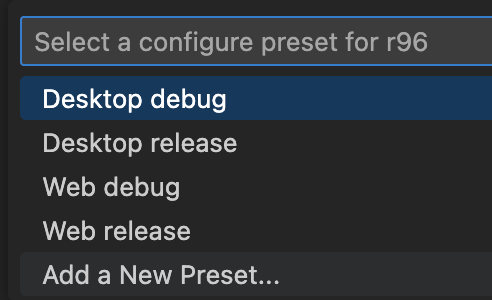
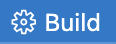
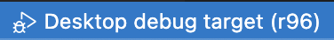
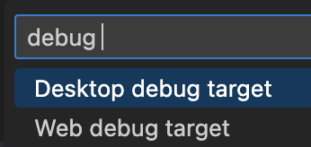
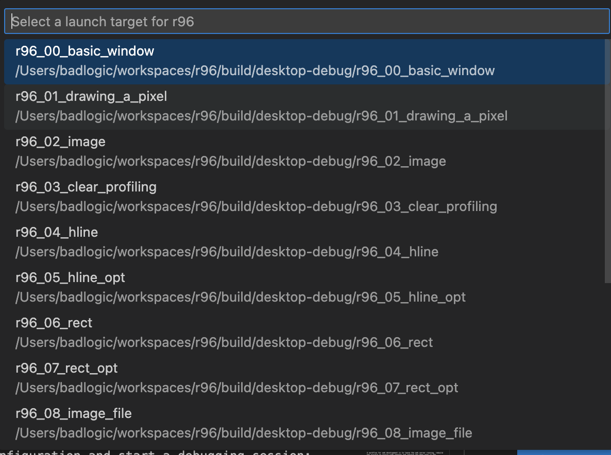
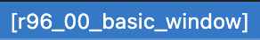

# r96

Repository for the blog post series ["Rendering like it's 1996"](https://marioslab.io/posts/rendering-like-its-1996/babys-first-pixel). The series walks you through building various software rasterization techniques as used in PC games and demos of the 90ies, while using "modern" technologies.

The code is written using C99 and can be run out of the box on Windows, Linux, macOS, and web browsers with WASM support.

The rasterization code itself is platform agnostic and should compile for any platform. The demos use a fork of [MiniFB](https://github.com/badlogic/MiniFB) to open a window, draw pixels to it, process input events, and query a high-precision timer.

[View the demos in your browser](https://marioslab.io/projects/r96/).

## Installing required tools
To compile this project for the desktop, and web, install these dependencies first:

* [Visual Studio Code](https://code.visualstudio.com/)
    * Ensure Visual Studio Code is available on the command line via the `code` command. This is the default on Windows and Linux. On macOS, press `CMD+SHIFT+P`, type `Shell Command: Install 'code' command in PATH`, and press enter.
* **Windows**
    * [Git for Windows](https://git-scm.com/download/win). Make sure its available on the command line via the system PATH. It's an option during installation.    
* **macOS**
    * [XCode](https://developer.apple.com/xcode/). Make sure to also install the [command line tools](https://mac.install.guide/commandlinetools/4.html)    
* **Linux**
    * Git, [GCC](https://gcc.gnu.org/), [GDB](https://www.sourceware.org/gdb/), Python, Cmake, Curl, libx11-dev, libxkbcommon-dev, and libgl1-mesa-dev E.g. Ubuntu/Debian: `sudo apt install build-essential git gdb python3.11 cmake curl libx11-dev libxkbcommon-dev libgl1-mesa-dev`

After successful installation, open a shell (or Git Bash on Windows), and run the `tools/download-tools.sh` script. It will download the remaining dependencies. On Linux, you may be prompted to install additional packages via your package manager.

You can now open the project in VS Code, or build and run it via the command line.

> **Note:** the first time you open a source file in VS Code, you may be asked to install the `clangd` server. Just click `Yes` in the notification to do so.

## Building and running in VS Code

<video src="https://user-images.githubusercontent.com/514052/211121019-a795af7c-983c-4bdb-b884-6336b8f9aa14.mp4" autoplay=true loop=true controls=true></video>

The video demonstrates tools installation, building, and debugging for all supported platforms.

### Building
The project uses [CMake](https://cmake.org/) as the build system. For each supported target platform, the build defines a [CMake configure preset](CMakePresets.json) which will build the code in debug and release mode for the selected target platform. When you first open the `r96` folder in VS Code, you'll be asked to select a configure preset.



Going with `Desktop debug` is a good starting point. You can switch the configure preset via the corresponding status bar entry.


You can now press the `Build` button in the status bar whenever you want to build the project for the specified configuration.



This will (incrementally) rebuild the code for the select platform. The resulting build output consisting of executables and assets can be found in `build/<os>-debug`. E.g. for Windows `build/windows-debug`, for macOS `build/macos-debug`, for DOS `build/dos-debug` and so on. When building a release preset, the output can be found in `build/<os>-release`.

To learn more about how to use VS Code CMake integration, check out the [documentation](https://vector-of-bool.github.io/docs/vscode-cmake-tools/index.html).

### Debugging and running
The project comes with a [`.vscode/launch.json`](.vscode/launch.json) file which defines launch configurations for each platform. Click the launch button in the status bar to select the launch configuration and start a debugging session:



After clicking this status bar entry, you'll be asked to select a launch configuration:



When you first start a debugging session, you'll be asked to select a launch target:



You can also change the launch target in the status bar:



After selecting the launch target, the code is incrementally rebuild, and the debugging session starts. 

Instead of going through the status bar, you can also start a new debugging sessions by pressing `F5`. This will launch a session for the currently selected launch configuration, preset, and launch target.


**Important:** the launch configuration MUST match the preset you selected:

* `Desktop debug target`: select the `Desktop debug` or `Desktop release` preset.
* `Web debug target`: select the `Web debug` or `Web release` preset.

Each supported platform behaves a bit different to the others when debugging.

#### Desktop
This is the standard debugging experience you are used to. Set breakpoints and watches, interrupt the program at any time, and so on.

#### Web
Debugging the C code compiled to WASM directly in VS Code is not possible. When you start a web debugging session, the respective launch configuration starts a local static file server and opens the `.html` file corresponding to the selected launch target in a browser tab.

When you are done "debugging", close the browser tab, and close the debugging session in VS Code by clicking the "Stop" button in the debugger controls.

 If you feel adventurous: it is possible to [debug the C and JavaScript code it in Chrome](https://marioslab.io/posts/rendering-like-its-1996/babys-first-pixel/#Can%20I%20debug%20the%20C%20code%20in%20the%20browser?) when building with the `Web debug` preset.

## Building and running on the command line
### Desktop
To build for your operating system in release mode:
```
cmake --preset <os>-release
cmake --build build/<os>-release
```

Valid values for `<os>` are `windows`, `linux`, and `macos`. E.g. on Windows:

```
cmake --preset windows-release
cmake --build build/windows-release
````

The resulting executables for each demo app and the copied `assets/` folder can then be found in the `build/<os>-release` directory. You can run them directly on your host system.

To build for your operating system in debug mode:
```
cmake --preset <os>-debug
cmake --build build/<os>-debug
```

The resulting executables and assets will end up in the `build/<os>-debug` directory.

You can either run the executables as is, or you can debug them with [LLDB](https://lldb.llvm.org/) (Windows, macOS) or [GDB](https://www.sourceware.org/gdb/) (Linux) on the command line.

### Web
To build for the web in release mode:
```
cmake --preset web-release
cmake --build build/web-release
```

This will generate a `.js` and `.wasm` file for each executable in `build/web-release`, as well as copy over the corresponding `.html` file from the `src/web` folder and `assets/` to `build/web-release`. 

To run the demos in your browser execute:

```
./tools/web/static-server build/web-release 8123
```

A workflow for web development is to leave the web server running, rebuild the project on source code changes and refresh the demo page in the browser.

To build for the web in debug mode:

```
cmake --preset web-debug
cmake --build build/web-debug
```

The resulting `.js`, `.wasm`, and `.html` files as well as the assets will end up in `build/web-debug`.

To run the debuggable demos in your browser execute:

```
./tools/web/static-server build/web-debug 8123
```

You can [debug both the JavaScript and C code in Chrome](https://developer.chrome.com/blog/wasm-debugging-2020/).
